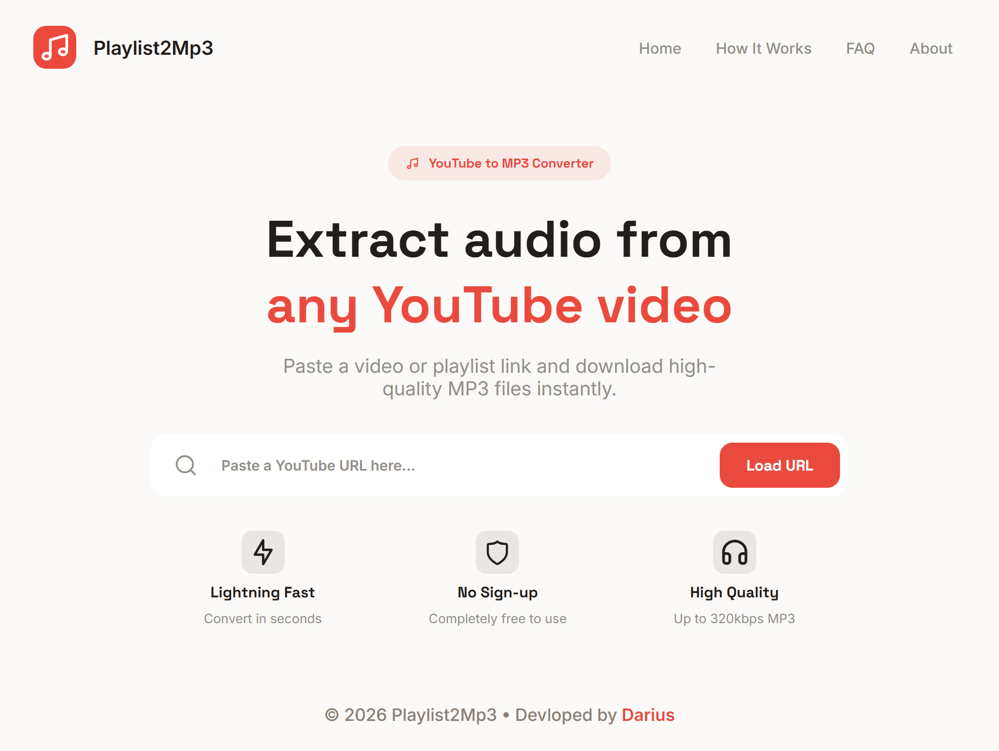
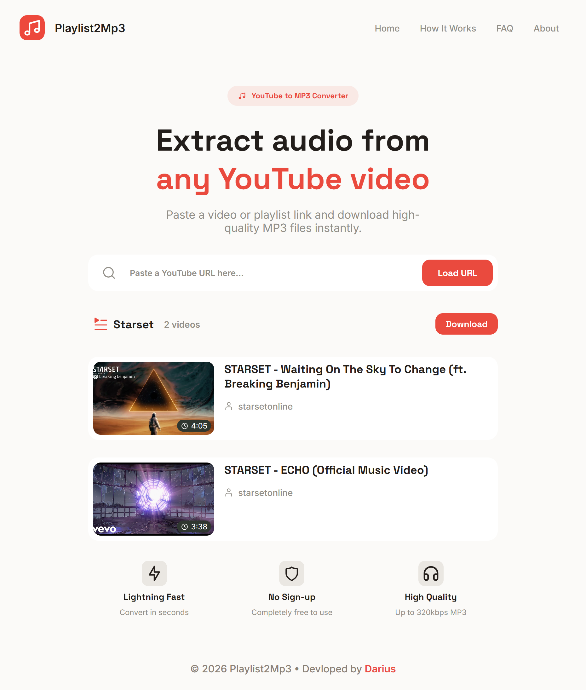
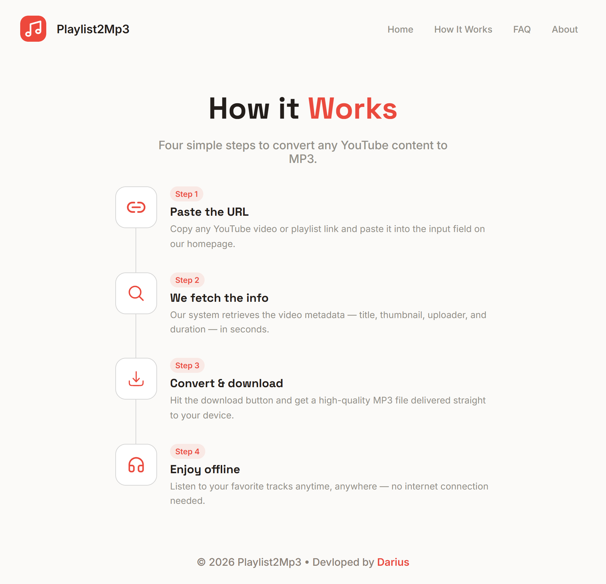
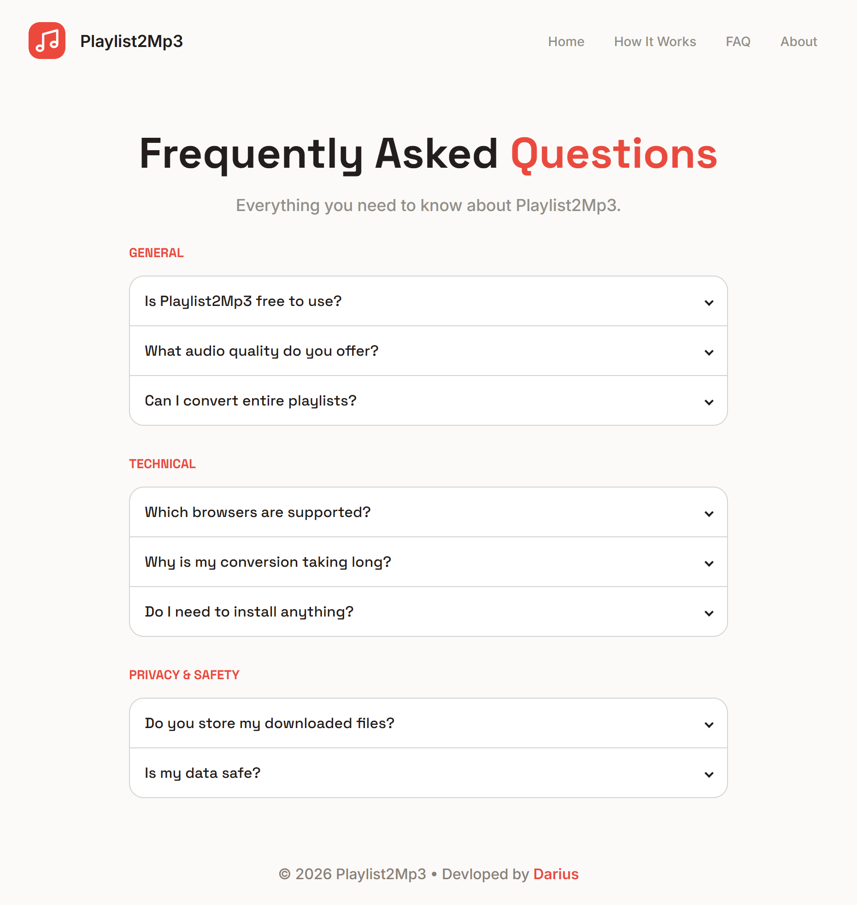
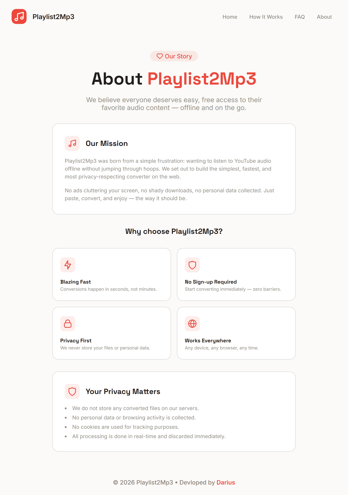

# Playlist2Mp3

## Overview

Playlist2Mp3 is a web application that converts YouTube videos and playlists into MP3 audio files for download. Users can download single videos or entire playlists, with playlists packaged into a ZIP archive. The app simplifies downloading multiple songs at once and provides an easy-to-use interface for all users.


## Motivation

Downloading music from YouTube can be tedious because most free tools only allow one video at a time. Playlist2Mp3 was created to automate this process. By providing a single playlist link, users can quickly convert all videos to MP3s, saving time and effort.

This project also served as a learning exercise for backend development, frontend–backend integration, media processing, and file management.


## Goals

### Primary Goals

- Convert a single YouTube video to MP3
- Convert entire playlists to MP3
- Download single MP3s or ZIP archives for playlists

### Secondary Goals

- Progress indicators during conversion
- Improved frontend design with animations
- Deployment as an online web service

## Scope & Limitations

### In Scope

- Single video to MP3 conversion
- Playlist to MP3 conversion with ZIP packaging
- Browser downloads via frontend interface
- Basic error handling for invalid URLs and unavailable videos

### Out of Scope

- Allow users to choose audio quality
- Video downloads in MP4 format
- Downloads from platforms other than YouTube
- User accounts or authentication
- Permanent server-side storage of files
- Streaming or playback features
- Mobile applications

### Ethical / Legal Considerations

The app is intended for personal and educational use. Users must ensure downloaded content complies with copyright laws. Playlist2Mp3 does not host or distribute media; it only processes publicly accessible URLs provided by the user.


## Target Users

Playlist2Mp3 is designed for anyone who wants to download YouTube music playlists or videos without technical knowledge. Typical users include individuals who want to save albums, playlists, or personal music collections for offline listening.

---

## Technology Stack

| Layer | Technology/Library | Purpose/Role |
| --- | --- | --- |
| Frontend | HTML | Structure the user interface |
|  | CSS | Style the interface and layout |
|  | JavaScript | Fetch API requests and handle downloads |
| Backend | Python | Server logic, file handling, media processing |
|  | Flask | Web framework for backend routes |
| Tools | yt-dlp | Download videos and playlists from YouTube |
|  | FFmpeg | Convert video audio to MP3 |
|  | Python Std Lib | File management, temporary directories, ZIP creation |


## System Architecture

Playlist2Mp3 follows a simple client–server architecture with a clear separation between the frontend and backend.

The backend is built using Flask, with all routes defined in `backend/app.py`. Core functionalities such as downloading media and handling files are modularized into separate modules like `downloader.py` and `utils.py`.

The frontend is built using HTML and CSS, with Jinja templates used for dynamic page rendering. A small amount of JavaScript is included for minor UI improvements such as dropdown menus and navigation bar behavior.

Downloaded files are stored temporarily in the `backend/downloads/` directory before being served to the user. After the download is completed, these files are automatically deleted to prevent unnecessary storage usage.

Users interact with the system through form submissions and button clicks. Flask processes the request, handles the download and conversion, and returns the final file to the browser.


## Application Workflow

1. User opens the homepage.
2. User pastes a YouTube video or playlist URL.
3. The backend validates the URL to ensure it is a YouTube link.
4. The backend determines whether the URL is a single video or a playlist.
5. The backend fetches all videos and displays only valid and available videos, skipping private, removed, or unlisted ones.
6. The user clicks the **Download** button to download all displayed videos.
7. `yt-dlp` downloads the audio content.
8. `FFmpeg` converts the downloaded media to MP3 format.
9. Files are temporarily stored in the `backend/downloads/` folder.
10. A single MP3 file or a ZIP archive (for playlists) is returned to the user.
11. The browser prompts the user to download the file.
12. Temporary files are automatically cleaned from the server.


## Key Features

- Single YouTube video to MP3 conversion
- Playlist conversion with automatic ZIP packaging
- URL validation for YouTube links
- Skips unavailable, private, or unlisted videos
- Flash messages for invalid or empty URLs
- Temporary file cleanup after download
- Responsive and modern UI
- Multiple pages: **Home, About, FAQ, and Download**


## Implementation Details

- **Playlist Detection:** URLs containing the keyword `playlist` are treated as playlists.
- **Video Download:** Audio is downloaded using the `yt-dlp` library.
- **MP3 Conversion:** `FFmpeg` converts downloaded audio to MP3 format.
- **ZIP Creation:** Playlists are packaged using Python’s `zipfile` module.
- **File Storage:** Temporary files are stored in `backend/downloads/` and deleted after download completes.
- **Frontend Interaction:** Users interact through form submissions and button clicks. Flask processes requests and serves files.
- **UI Enhancements:** Minor JavaScript is used for dropdown menus and navigation bar functionality.


## Error Handling & Edge Cases

- Invalid or non‑YouTube URLs trigger a flash message.
- Empty input fields are ignored and not processed.
- Removed, private, or unlisted videos are skipped automatically.
- All available videos are downloaded without requiring user selection.
- No download failures have been encountered so far during testing.


## Security & Performance Considerations

- Input URLs are validated to ensure they are legitimate YouTube links.
- Temporary files are automatically deleted to prevent excessive storage usage.
- Files are processed locally before being served to the user for better performance.
- Currently, there are no limits on playlist size.


## User Interface Design

- Modern and responsive layout that works on desktop and mobile devices.
- Four main pages:
  - **Home:** Main download interface and instructions
  - **About:** Project background and purpose
  - **FAQ:** Answers to common questions
  - **Download:** Download links and buttons
- Simple interface with one URL input field and a single **Download** button.
- Loading indicator appears while videos are being fetched.
- Minimalistic design for easy navigation.
- Minor JavaScript used for dropdown menus and navigation bar interactions.


## Testing Strategy

Testing has primarily been performed manually.

Test cases included:

- Single video downloads
- Playlist downloads of varying lengths
- Invalid URL handling
- Skipping unavailable or private videos

Currently, no automated tests are implemented. Future versions will include automated testing for:

- Download functionality
- MP3 conversion
- Playlist handling


## Challenges & Problems Faced

- Efficiently zipping multiple MP3 files after downloading playlists
- Optimizing download speed for large playlists
- Managing temporary files and ensuring they are properly cleaned up
- Coordinating backend download logic with frontend template rendering
- Balancing backend functionality and UI development without slowing overall progress


## Solutions & Key Learnings

- Modularized the code into `downloader.py` and `utils.py` for cleaner structure.
- Improved understanding of Flask routing and backend architecture.
- Gained experience with Python file management and media processing using `FFmpeg`.
- Developed frontend skills with HTML, CSS, and responsive layout design.
- Learned the importance of prioritizing core functionality before UI improvements.


## Future Improvements

- Add a download progress bar for playlist downloads
- Deploy the application online using Docker
- Implement automated testing
- Improve error handling and reliability

## Project Setup & Installation

### Prerequisites
**UV package manager** must be installed:

**macOS/Linux:**
```bash
curl -LsSf https://astral.sh/uv/install.sh | sh
```

**Windows(PowerShell):**
```bash
powershell -ExecutionPolicy ByPass -c "irm https://astral.sh/uv/install.ps1 | iex"
```

### Sync dependencies with UV
```bash
uv sync
```

### Activate Virtual Environment
```bash
.venv/Scripts/activate
```

### Run the backend
```bash
uv run backend/app.py
```


## Ethical & Legal Disclaimer

Playlist2Mp3 is intended for **personal and educational use only**.  

- Users must ensure they respect copyright laws when downloading content.  
- The developers are **not responsible** for any misuse of the application.  


## Conclusion & Reflection

This project allowed significant growth in both backend and frontend development:  

- Improved **backend skills** with Flask, file handling, and media processing.  
- Modularized code streamlined functionality and simplified future improvements.  
- Strengthened **frontend skills**, particularly in responsive layouts and clean UI design.  

Overall, Playlist2Mp3 demonstrates a balance of **practical utility and learning**, providing a solid foundation for future web development projects.


## Project Screenshots

### Home Page


### Videos / Playlist Download


### How It Works


### FAQ Page


### About Page


